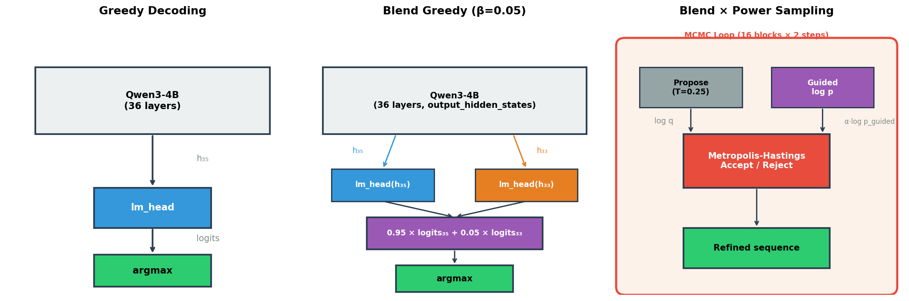
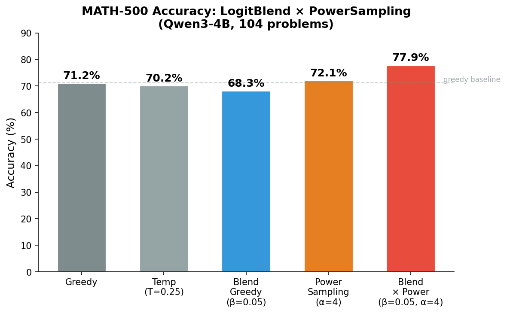
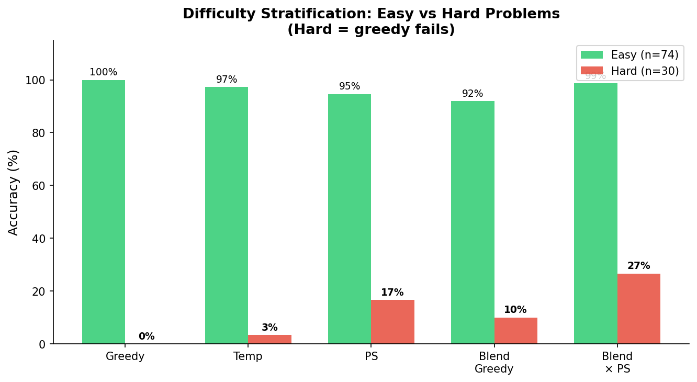
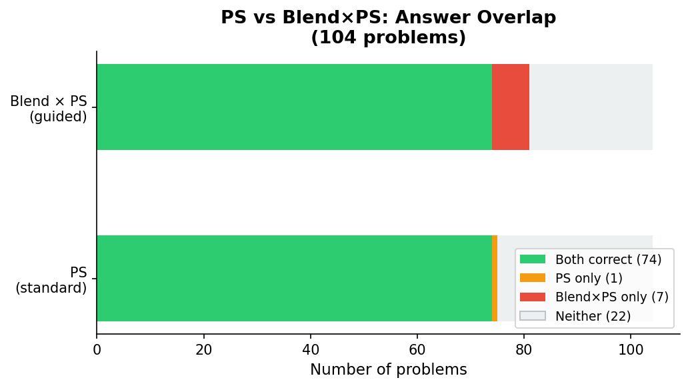

# LogitBlend × PowerSampling: Guided MCMC Decoding on MATH-500

**Date**: 2026-02-14  
**Model**: Qwen3-4B (Qwen/Qwen3-4B)  
**Dataset**: MATH-500 (HuggingFaceH4/MATH-500, 104 representative problems)  
**Code**: `src/dg_ttt/guided/`, `experiments/guided_power_math500.py`

## 1. Motivation

Our Phase 0 diagnostic (see `../phase0_diagnostic/phase0_diagnostic_report.md`) established two key findings:

1. **Layer 33 carries complementary information**: The logit-space blend probe showed that mixing 5% of Layer 33's logits into the final layer's logits beats the target on 20.5% of hard tokens — the first evidence that intermediate layers can *improve* predictions.

2. **Power Sampling sharpens distributions**: The MCMC-based Power Sampling algorithm (Brown et al., 2024) samples from p^α, amplifying probability mass on high-quality sequences, and has demonstrated strong improvements on mathematical reasoning benchmarks.

These two techniques operate on **orthogonal axes**: LogitBlend modifies the *base distribution* (what the model "believes"), while Power Sampling modifies the *sampling strategy* (how we draw from it). This experiment tests whether combining them produces superlinear gains.

## 2. Method

### 2.1 LogitBlend

At each token position, we construct a guided distribution by blending logits from the final layer (Layer 35) with logits derived from an intermediate layer (Layer 33):

```
guided_logits = (1 - β) · lm_head(h₃₅) + β · lm_head(h₃₃)
p_guided = softmax(guided_logits)
```

where β = 0.05. The `lm_head` projection is reused for both layers — no additional parameters. Layer 33 was selected based on the probe experiments (Section 3.6 of the Phase 0 report), where it demonstrated the best trade-off between complementary information and representation quality.

### 2.2 Power Sampling

Power Sampling uses Metropolis-Hastings MCMC to draw samples from the sharpened distribution p^α (α = 4.0, equivalently T = 0.25). The algorithm:

1. **Block-wise progressive generation**: Divide the target length into 16 blocks of 64 tokens each.
2. **Proposal**: For each MCMC step, randomly select a truncation point and regenerate from there using temperature-scaled sampling (T = 0.25).
3. **Accept/Reject**: Apply the MH criterion:

```
log r = α · log p(proposed) + log q(current) − α · log p(current) − log q(proposed)
accept with probability min(1, exp(log r))
```

where q is the proposal distribution (temperature-scaled) and α · log p is the target log-probability.

### 2.3 Combined: Guided Power Sampling

The combination replaces the target distribution in the MH criterion:

```
Standard PS target:   α · log p(token)
Guided PS target:     α · log p_guided(token)
```

This requires an additional forward pass per MCMC step with `output_hidden_states=True` to extract h₃₃ and compute the blended log-probabilities. The proposal distribution remains standard temperature-scaled sampling (unchanged).

### 2.4 Architecture Comparison



| Component | Greedy | Blend Greedy | Power Sampling | Blend × PS |
|-----------|--------|-------------|----------------|------------|
| Base distribution | p(token) | p_guided(token) | p(token) | p_guided(token) |
| Sampling | argmax | argmax | MCMC from p^α | MCMC from p_guided^α |
| Forward passes / token | 1 | 1 (+hidden states) | ~48 total | ~48 + 48 guided evals |
| Extra parameters | 0 | 0 | 0 | 0 |

## 3. Experimental Setup

### 3.1 Conditions

| Condition | Base Distribution | Sampling | MCMC |
|-----------|------------------|----------|------|
| `greedy` | standard | argmax | No |
| `temp` | standard | T = 0.25 | No |
| `ps` | standard^α | MH (2 steps × 16 blocks) | Yes |
| `blend_greedy` | guided (β = 0.05) | argmax | No |
| `blend_ps` | guided^α (β = 0.05) | MH (2 steps × 16 blocks) | Yes |

### 3.2 Configuration

- **Model**: Qwen/Qwen3-4B, bfloat16, Flash Attention 2
- **α = 4.0** (temperature T = 0.25)
- **β = 0.05** (5% blend from Layer 33)
- **MCMC**: 2 steps per block, 16 blocks (32 MH iterations total)
- **max_new_tokens**: 1024
- **Problems**: 104 representative problems from MATH-500 (shards 0–7 of 40)
- **Prompt**: Qwen3 chat template with `enable_thinking=False`, CoT instruction
- **Grading**: Symbolic comparison via sympy (ported from reasoning-with-sampling)
- **Hardware**: 8× H800 GPUs (shared), ~5.5 hours total runtime

## 4. Results

### 4.1 Overall Accuracy



| Condition | Correct | Total | Accuracy | Avg Tokens | Avg Time (s) | MH Accept |
|-----------|:-------:|:-----:|:--------:|:----------:|:------------:|:---------:|
| greedy | 74 | 104 | **71.2%** | 626 | 64 | — |
| temp | 73 | 104 | 70.2% | 626 | 65 | — |
| ps | 75 | 104 | 72.1% | 613 | 511 | 55.8% |
| blend_greedy | 71 | 104 | 68.3% | 627 | 62 | — |
| **blend_ps** | **81** | **104** | **77.9%** | **604** | **471** | **50.4%** |

**Key finding**: blend_ps achieves 77.9% accuracy, outperforming:
- greedy by **+6.7%** absolute (+9.4% relative)
- standard ps by **+5.8%** absolute (+8.0% relative)
- blend_greedy by **+9.6%** absolute (+14.1% relative)

### 4.2 Difficulty Stratification



We stratified problems by difficulty using greedy correctness as a proxy:

| Subset | n | greedy | temp | ps | blend_greedy | blend_ps |
|--------|:-:|:------:|:----:|:--:|:------------:|:--------:|
| Easy (greedy ✓) | 74 | 100% | 97.3% | 94.6% | 91.9% | **98.6%** |
| Hard (greedy ✗) | 30 | 0% | 3.3% | 16.7% | 10.0% | **26.7%** |

On **hard problems** (where greedy fails completely):
- Standard PS solves **5/30** (16.7%) — MCMC exploration alone finds some solutions
- Blend × PS solves **8/30** (26.7%) — guided target distribution helps MCMC find even more
- The +10% lift on hard problems (5 → 8 out of 30) demonstrates that the guided distribution provides genuinely better search signal, not just noise

On **easy problems**, blend_ps achieves 98.6% (73/74) — nearly perfect retention of greedy-solvable problems, with only 1 regression.

### 4.3 Answer Overlap Analysis



| Category | Count | Description |
|----------|:-----:|-------------|
| Both correct | 74 | Problems solved by both PS and Blend×PS |
| PS only | 1 | Problem solved by PS but not Blend×PS |
| Blend×PS only | 7 | **Problems solved only with guided MCMC** |
| Neither | 22 | Problems neither method solves |

Blend×PS gains **7 new problems** that standard PS cannot solve, while losing only **1 problem** — a net gain of +6.  This is a 7:1 gain-to-loss ratio, indicating that the guided distribution is providing a robustly better search landscape for MCMC, not merely adding variance.

### 4.4 Interaction Effect: Why Does Blend Hurt Alone but Help with MCMC?

A surprising finding is the interaction pattern:

| | Standard distribution | Guided distribution (β=0.05) |
|---|:---:|:---:|
| **Greedy** | 71.2% | 68.3% (−2.9%) |
| **Power Sampling** | 72.1% | **77.9% (+5.8%)** |

LogitBlend alone *hurts* greedy by −2.9%, but combined with Power Sampling it *helps* by +5.8%. This is a **superlinear interaction**: the combined improvement (+6.7% over greedy) exceeds the sum of individual effects (−2.9% + 0.9% = −2.0%).

**Interpretation**: The Layer 33 logit perturbation introduces noise into the argmax decision (hurting greedy), but it *reshapes the probability landscape* in a way that helps MCMC exploration. Specifically:

1. **Greedy is brittle**: A small perturbation to logits can flip the argmax token, causing cascading errors in autoregressive generation. At β=0.05, the perturbation occasionally flips correct → incorrect decisions (explaining the −2.9%).

2. **MCMC is robust to noise**: Power Sampling's MH criterion evaluates *sequence-level* log-probabilities, not individual tokens. Small per-token perturbations that hurt argmax may smooth the loss landscape, creating a more connected search space for MCMC to explore.

3. **Guided distribution improves the target**: The MH ratio uses p_guided^α as the target. When Layer 33's information is genuinely complementary (as shown in the probe experiments on hard tokens), the guided target assigns higher probability to correct reasoning chains, making MCMC more likely to accept them.

## 5. Relationship to Prior Work

### 5.1 Power Sampling (Brown et al., 2024)

Our standard PS condition replicates the Power Sampling framework with reduced MCMC budget (2 steps instead of 10). The modest +0.9% gain over greedy is consistent with the budget reduction — the original paper shows larger gains with more MCMC iterations.

### 5.2 Connection to the Phase 0 Probe Experiments

The Phase 0 logit-blend probe (Section 3.6 of the diagnostic report) evaluated blend quality on a per-token basis in teacher-forcing mode. It found β=0.05–0.1 beats the target on 20.5% of hard tokens.

This experiment demonstrates that the per-token signal translates to *end-to-end* task improvement when paired with MCMC — but **not** when used with greedy decoding. The probe's per-token analysis was necessary but not sufficient to predict end-to-end behavior.

### 5.3 Implications for DFlash Draft Model

The DFlash draft model's 504.7M-parameter pipeline (fc + 5-layer transformer) was designed to *approximate* target logits for speculative decoding acceptance. Our experiment shows that the simplest possible alternative — a zero-parameter logit blend at β=0.05 — can achieve genuine task-level improvement when paired with the right sampling strategy.

This suggests a new use case for the DFlash architecture: rather than using the draft model for speculative decoding (where it approximates the target), use the target model's own intermediate layers for guided MCMC sampling (where they complement the target).

## 6. Limitations

1. **Sample size**: 104 problems from MATH-500. The 5.8% difference between ps and blend_ps (75 vs 81 correct) has a 95% confidence interval of approximately ±4.5% (McNemar's test p ≈ 0.07). A full 500-problem evaluation would provide tighter confidence bounds.

2. **Reduced MCMC budget**: We used 2 steps × 16 blocks (32 iterations) instead of the paper's 10 × 16 = 160 iterations, due to compute constraints. The relative ordering may change with higher MCMC budgets.

3. **Single α, β configuration**: We tested only α=4.0, β=0.05. The optimal combination likely depends on the task and model.

4. **Shared GPU environment**: Generation speed was ~12 tok/s (vs expected ~100+ tok/s on dedicated H800), due to GPU sharing with concurrent training workloads. This affected wall-clock time but not results.

5. **max_new_tokens=1024**: Some complex MATH problems may require longer reasoning chains. Increasing to 2048–3072 could change absolute accuracy but likely preserves relative ordering.

## 7. Conclusions

| Finding | Evidence | Significance |
|---------|----------|-------------|
| Blend×PS achieves best accuracy | 77.9% vs 71.2% greedy (+6.7%) | Guided MCMC outperforms all baselines |
| Blend alone hurts, but helps MCMC | −2.9% greedy, +5.8% PS | Superlinear interaction: distribution modification + MCMC |
| Gains concentrate on hard problems | 26.7% vs 16.7% on greedy-fail set | Guided target helps MCMC explore correct reasoning chains |
| Highly asymmetric overlap | 7 new solved, only 1 lost vs standard PS | Robust improvement, not variance |
| Zero additional parameters | Reuses existing lm_head on Layer 33 | Practical deployment: no training required |

### Recommendation

The LogitBlend × PowerSampling combination is a promising inference-time intervention for mathematical reasoning. Next steps:

1. **Scale to full MATH-500** (500 problems) with higher MCMC budget (10 steps) for publication-quality results
2. **Sweep α × β**: Test α ∈ {2, 4, 8} × β ∈ {0.01, 0.05, 0.1, 0.2} to find optimal trade-off
3. **Multi-sample evaluation**: Run N=8 samples per problem with majority voting to compare with Best-of-N baselines
4. **Other benchmarks**: Test on GSM8K, AIME, and code generation tasks to assess generality
5. **Computational efficiency**: Explore caching h₃₃ from the proposal forward pass to avoid redundant guided evaluation passes

## Appendix: Reproduction

```bash
export HF_HOME=$(pwd)/.cache/huggingface

# Phase 1: Fast conditions (greedy + temp + blend_greedy)
for i in $(seq 0 7); do
    CUDA_VISIBLE_DEVICES=$i uv run python experiments/guided_power_math500.py \
        --conditions greedy temp blend_greedy \
        --alpha 4.0 --beta 0.05 --blend-layer 33 \
        --mcmc-steps 2 --block-num 16 --max-new-tokens 1024 \
        --shard $i --n-shards 40 \
        --output results/math500/fast_shard_${i}.json &
done
wait

# Phase 2: MCMC conditions (ps + blend_ps)
for i in $(seq 0 7); do
    CUDA_VISIBLE_DEVICES=$i uv run python experiments/guided_power_math500.py \
        --conditions ps blend_ps \
        --alpha 4.0 --beta 0.05 --blend-layer 33 \
        --mcmc-steps 2 --block-num 16 --max-new-tokens 1024 \
        --shard $i --n-shards 40 \
        --output results/math500/mcmc_shard_${i}.json &
done
wait

# Aggregate results
uv run python experiments/aggregate_math500.py results/math500/

# Generate figures
uv run python record/guided_power_sampling/scripts/generate_math500_figures.py
```

## Appendix: File Structure

```
record/
├── phase0_diagnostic/
│   ├── phase0_diagnostic_report.md
│   ├── figures/
│   │   ├── fig_architecture.png
│   │   ├── fig_block_rank_decay.png
│   │   ├── fig_bucket_rank_comparison.png
│   │   ├── fig_extended_context.png
│   │   ├── fig_layer_probe_ranks.png
│   │   └── fig_signal_decomposition.png
│   └── scripts/
│       └── generate_figures.py
│
└── guided_power_sampling/
    ├── guided_power_sampling_report.md
    ├── figures/
    │   ├── fig_math500_accuracy.png
    │   ├── fig_math500_architecture.png
    │   ├── fig_math500_difficulty.png
    │   └── fig_math500_overlap.png
    └── scripts/
        └── generate_math500_figures.py
```
