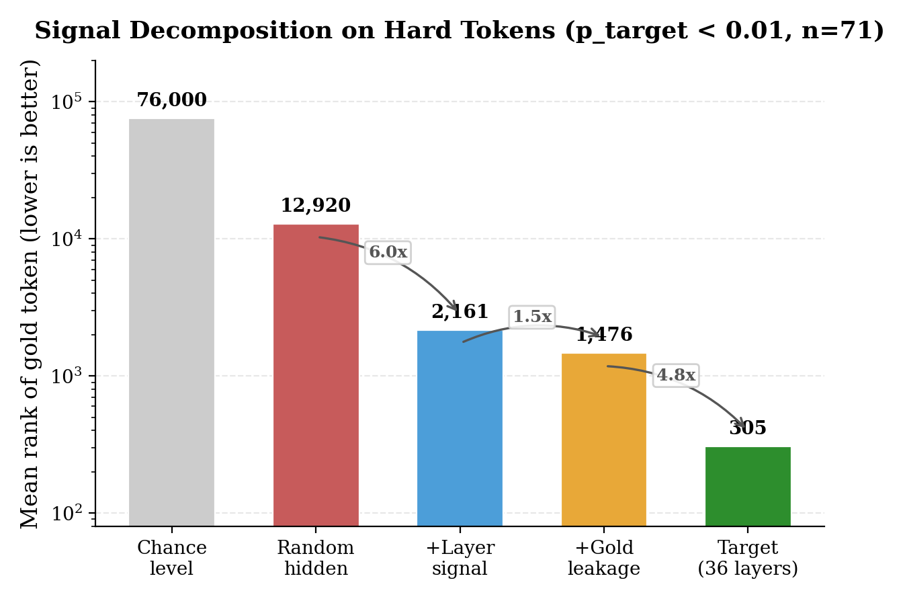

# Phase 0.3 Diagnostic Report: Is the Draft Model a Deep Readout?

**Date**: 2026-02-13  
**Model**: Qwen3-4B (target) + DFlash-b16 (draft)  
**Dataset**: GSM8K test set (5 examples, 465 compared tokens)  
**Script**: `scripts/diagnostic.py`

## 1. Motivation

The DFlash draft model reads five intermediate layers of the target model ({1, 9, 17, 25, 33}) through cross-attention KV injection, processes them through a 5-layer transformer, and maps through the **same shared `lm_head`** as the target. We hypothesized that this architecture constitutes a "deep readout" of the target's internal state, potentially surfacing information that the target's direct Layer 36 → `lm_head` pathway (a single linear projection, i.e., "shallow readout") misses.

This diagnostic tests whether the draft pathway assigns higher probability — or, more rigorously, better **rank** — to correct (gold) tokens than the target pathway, particularly on tokens where the target is uncertain.

## 2. Experimental Design

### 2.1 Setup

Both pathways receive the same input: `prompt + gold_answer` in teacher-forcing mode. The target performs a single forward pass. The draft processes answer tokens in non-overlapping blocks of 16, using a KV cache that mirrors `spec_generate`.

### 2.2 Three Controlled Conditions

A critical confound exists: the draft model uses **non-causal attention** over the block's noise embeddings. In teacher-forcing with gold tokens as noise, the draft can "peek" at future gold tokens within each block — information unavailable during actual speculative decoding. We designed three conditions to decompose this:

| Mode | `noise_embedding` | `target_hidden` | What it tests |
|------|--------------------|-----------------|---------------|
| `gold` | Gold token embeddings | Real intermediate features | Upper bound (includes info leakage) |
| `mask` | Mask token embeddings (position 0 = known token) | Real intermediate features | **Fair comparison** (matches spec_generate) |
| `random` | Gold token embeddings | Norm-matched Gaussian noise | Ablation: leakage without layer signal |

All three conditions share identical `target_logits` (the baseline). Only the draft pathway inputs differ.

### 2.3 Metrics

- **Probability (p)**: `softmax(logits)[gold_token_id]`. Sensitive to entropy — a uniform distribution trivially "wins" on tokens where the reference model is uncertain.
- **Rank**: Position of the gold token in the probability-sorted vocabulary (1 = top prediction). **Immune to entropy effects**: a uniform distribution yields rank ~V/2 ≈ 76,000 and can never "win".

## 3. Results

### 3.1 Overall Summary

| Mode | Mean p_target | Mean p_draft | Mean rank_target | Mean rank_draft | % rank draft wins |
|------|:---:|:---:|:---:|:---:|:---:|
| gold | 0.7484 | 0.1320 | 48 | 539 | 3.9% |
| mask | 0.7484 | 0.1168 | 48 | 526 | 3.0% |
| random | 0.7484 | 0.0509 | 48 | 9,145 | 3.2% |

The draft model is a substantially weaker decoder than the target across all conditions. The target's mean rank of 48 indicates it typically places the gold token in its top 50 predictions; the draft, even in the best case (mask, rank 526), places it ~10x further down.

### 3.2 Breakdown by Target Confidence

**Figure 1** (see `fig_bucket_rank_comparison.png`)

Low-confidence bucket (p_target < 0.01, n = 71 tokens):

| Mode | Mean rank_target | Mean rank_draft | % rank draft wins | % prob draft wins |
|------|:---:|:---:|:---:|:---:|
| gold | 305 | 1,476 | 18.3% | 87.3% |
| mask | 305 | 2,161 | 14.1% | 78.9% |
| random | 305 | 12,920 | 16.9% | 73.2% |

The 87% "probability wins" in `gold` mode — the original result that appeared to show draft advantage — **collapses to 18% on rank**, and the `random` ablation achieves 73% probability wins despite having no meaningful signal (rank 12,920). This conclusively demonstrates the probability metric was dominated by entropy effects.

### 3.3 Causal Decomposition

Using the low-confidence bucket as the diagnostic window:



| Component | Computation | Rank improvement | Factor |
|-----------|-------------|:---:|:---:|
| Random baseline | — | 12,920 | 1.0x |
| + Intermediate layer signal | random → mask | 12,920 → 2,161 | **6.0x** |
| + Gold token leakage | mask → gold | 2,161 → 1,476 | 1.5x |
| Combined | random → gold | 12,920 → 1,476 | 8.8x |
| Target (36 layers) | — | 305 | 42.3x |
| Chance level | — | ~76,000 | 0.17x |

**The intermediate layers provide genuine signal** (6x rank improvement over random), but **this signal falls far short** of the target's 36-layer processing (305 vs 2,161 = 7x gap remains).

### 3.4 Per-Block Analysis

**Figure 3** (see `fig_block_rank_decay.png`)

Block 0 receives the full prompt's intermediate features as context (~96 positions). Subsequent blocks receive only the previous block's 16 positions.

| Block | Context positions | rank_target | rank_draft (mask) | rank_draft (gold) |
|:---:|:---:|:---:|:---:|:---:|
| 0 | 96 (full prompt) | 174 | **114** | 171 |
| 1 | 16 | 5 | 2,570 | 1,726 |
| 2 | 16 | 4 | 115 | 260 |
| 3 | 16 | 2 | 166 | 94 |
| 4 | 16 | 2 | 195 | 221 |

**Block 0 is the only block where the draft's rank (114) is competitive with the target's rank (174).** This is also the only block where the draft receives rich, multi-position context directly from the target's intermediate layers. Starting from Block 1, context drops to 16 positions and the draft's rank degrades sharply, though it partially recovers via KV cache accumulation.

## 4. Architecture Analysis

### 4.1 Parameter Budget

| Component | Parameters | Role |
|-----------|:---:|------|
| Target: 36 transformer layers | 3,244.6M | Deep nonlinear processing |
| Target: embed_tokens | 389.0M | Shared with draft |
| Target: lm_head | 389.0M | Shared with draft (tied weights) |
| Draft: fc (12800→2560) | 32.8M | **5:1 compression bottleneck** |
| Draft: 5 transformer layers | 504.7M | 15.5% of target's layer compute |

The `fc` projection compresses five layers of 2560-dim hidden states (total 12,800 dims) into 2560 dims through a single linear map — a 5:1 compression with no nonlinearity. This is a severe information bottleneck.

### 4.2 Why the Draft Cannot Match the Target

1. **Capacity asymmetry**: 5 layers (504.7M) vs 36 layers (3,244.6M) — the draft has 6.4x less compute for the same hidden dimension.

2. **`lm_head` alignment**: `lm_head` was co-trained with the target's 36 layers. It expects the specific representation geometry that Layer 36 produces. The draft's 5-layer output occupies a different region of representation space, which `lm_head` was never optimized to decode.

3. **Context starvation after Block 0**: In `spec_generate` (and our mask mode), the draft receives only 16 new positions of `target_hidden` per block after Block 0. The KV cache retains projections from earlier blocks, but these are indirect (filtered through 5 shallow layers), degrading rapidly.

4. **Mask-mode information poverty**: With mask tokens at positions 1–15, all queries are identical (same mask embedding, differentiated only by RoPE). The draft must reconstruct 15 different predictions from position encoding + context attention alone — a much harder task than what the autoregressive target faces.

## 5. Limitations

1. **Sample size**: 5 examples, 465 tokens. Results are directional, not statistically robust. Block-level analysis (n=45–75 per block) has high variance.

2. **Dataset mismatch**: GSM8K tests mathematical reasoning, not context learning. The tokens where p_target < 0.01 largely reflect stylistic differences between human-written and model-preferred phrasing, not failures of context understanding. CL-bench evaluation is needed to test the actual hypothesis.

3. **Context length**: GSM8K prompts are ~100 tokens. CL-bench contexts are 20K–90K tokens. The Block 0 advantage (which depends on rich context) may be more pronounced with longer prompts, but information decay through shallow KV cache would also be more severe.

## 6. Conclusions

| Finding | Evidence | Implication |
|---------|----------|-------------|
| Intermediate layers carry real signal | mask vs random: 6x rank improvement | The `fc` + 5-layer architecture extracts useful information from intermediate representations |
| Signal is insufficient for guided decoding | mask rank 2,161 vs target rank 305 (7x gap) | Vanilla draft logits would degrade, not improve, target predictions |
| Original "87% draft wins" was an entropy artifact | random mode also shows 73% prob wins with rank 12,920 | Raw probability comparison is invalid for models with different entropy |
| Block 0 shows competitive rank when context is rich | Block 0: draft rank 114 ≈ target rank 174 | With sufficient context positions, the draft architecture CAN approach target quality |

### Recommendation

The vanilla draft model is **not suitable for guided decoding** (Phase 2 of the roadmap). The path forward is:

- **Phase 1 (TTT)** remains valuable as a method to improve speculative decoding acceptance rate (τ), which is a standalone publishable contribution.
- **Block 0 phenomenon** warrants investigation: if the draft performs well with rich context, modifications to the context delivery mechanism (e.g., providing more target_hidden positions to later blocks, or periodic re-injection of prompt features) could improve draft quality.
- **CL-bench evaluation** is necessary to test whether the context learning failure mode differs from GSM8K's stylistic mismatch.

## Appendix: Reproduction

```bash
# Run all three modes
for mode in gold mask random; do
  CUDA_VISIBLE_DEVICES=0 uv run python scripts/diagnostic.py \
    --model Qwen/Qwen3-4B \
    --draft z-lab/Qwen3-4B-DFlash-b16 \
    --dataset gsm8k \
    --mode $mode \
    --max-samples 5 \
    --output results/phase0/test_${mode}.json
done

# Generate figures
uv run python record/generate_figures.py
```
