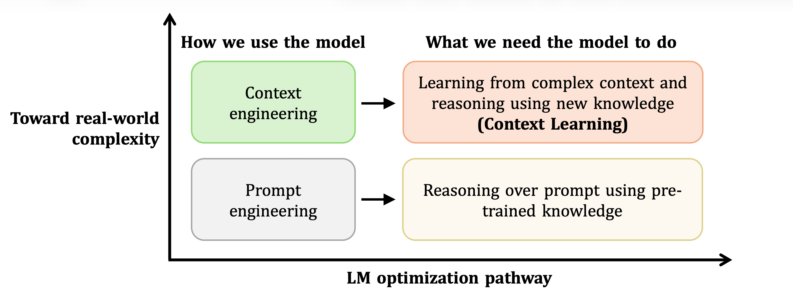
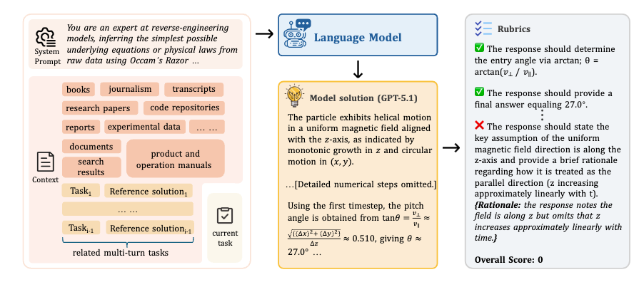

<div align="center">

</div>

<div align="center">
<h1>CL-bench: A Benchmark for Context Learning</h1>

[](https://www.clbench.com)
[](https://arxiv.org/abs/2602.03587)
[](https://huggingface.co/datasets/tencent/CL-bench)
[](https://hy.tencent.com/research/100025?langVersion=en)

</div>

CL-bench represents a step towards building LMs with this fundamental capability, making them more intelligent and advancing their deployment in real-world scenarios.

<p align="center">
  
</p>

*Figure 1: Mismatch between how language models are commonly optimized in practice and the capabilities required by real-world tasks.*

<br>

Resolving tasks in CL-bench requires models to learn new knowledge from the provided context, ranging from domain-specific knowledge, rule systems, and complex procedures to laws derived from empirical data, all of which are absent from pre-training.
Such tasks almost cannot be solved by models that rely solely on static knowledge acquired during pre-training.

<p align="center">
  
</p>

*Figure 2: Each instance in CL-bench comprises a system prompt, a task, the context containing the new knowledge necessary for solving the task, and rubrics to assess the task. All instances are annotated by experienced domain experts.*

## 🏆 Leaderboard

You can find the full leaderboard at [www.clbench.com](https://www.clbench.com)!

## ⭐ Key Features

- 🏅 **Realistic & High-quality**: Each context, task, and rubric is crafted by domain experts and refined through multiple rounds of rigorous quality review
- 🛡️ **Contamination-free**: Contexts contain new knowledge absent from pre-training, constructed by domain experts through three approaches: fictional creation, modification of existing knowledge, or incorporation of niche and emerging specialized knowledge. Solving these tasks requires models to learn from the context instead of depending only on pre-trained knowledge.
- 🔥 **Challenging**: Up to 12 tasks per context (avg. 3.8); annotating each context requires an average of 20 hours of expert effort; multi-turn interactions with task dependencies
- ✅ **Rigorously Verifiable**: Average 63.2 rubrics per context, annotated by experts to assess whether the model solution fully solves the task across multiple dimensions.
- 📦 **Self-contained**: All required knowledge provided within context, no external retrieval needed

## 📋 Overview

CL-bench provides:

- ✅ **Novel knowledge contexts**: Evaluate LMs on newly created and niche long-tail knowledge that largely extends beyond what models could have acquired during pre-training
- ✅ **Diverse task categories**: Four context categories (Domain Knowledge Reasoning, Rule System Application, Procedural Task Execution, Empirical Discovery & Simulation) and 18 sub-categories
- ✅ **Challenging evaluation**: Even the best-performing model (GPT-5.1) achieves only 23.7%, with an average of 17.2% across all evaluated models
- ✅ **Automatic evaluation**: LM-based verifier with carefully annotated task-level rubrics

## 📊 Dataset

- **Samples**: 1,899 tasks
- **Format**: JSONL (one JSON object per line)
- **Dataset**: Available on [Hugging Face](https://huggingface.co/datasets/tencent/CL-bench)

### Data Structure

Each sample contains:

```json
{
  "messages": [
    {"role": "system", "content": "..."},
    {"role": "user", "content": "..."},
    {"role": "assistant", "content": "..."},
    ...
  ],
  "rubrics": [
    "Rubric 1, description of requirement",
    "Rubric 2, description of requirement",
    ...
  ],
  "metadata": {
    "task_id": "unique-task-identifier",
    "context_id": "unique-context-identifier",
    "context_category": "...",
    "sub_category": "..."
  }
}
```

- **messages**: Follow OpenAI chat format
- **rubrics**: List of evaluation criteria for grading model solutions
- **metadata**: Task id and category information and other metadata

## 🚀 Quick Start

### Prerequisites

```bash
pip install openai tqdm
```

### 1. Run Inference

```bash
# Set your API key
export OPENAI_API_KEY="your_api_key"

# Run inference with GPT-5.1
python infer.py --model gpt-5.1 --input CL-bench.jsonl --output outputs/gpt5-1.jsonl

# Use other OpenAI-compatible APIs (e.g., DeepSeek)
python infer.py --model deepseek-chat \
    --base-url https://api.deepseek.com/v1 \
    --api-key your_deepseek_key \
    --output outputs/deepseek.jsonl

# Enable concurrent inference
python infer.py --model gpt-5.1 --workers 20
```

### 2. Run Evaluation

```bash
# Evaluate model outputs using GPT-5.1 as judge
python eval.py --input outputs/gpt5-1.jsonl --judge-model gpt-5.1
```

## 📁 File Structure

```
CL-bench/
├── README.md           # This file
├── infer.py            # Inference script
├── eval.py             # Evaluation script
├── requirements.txt    # Python dependencies
└── outputs/            # Output directory (created automatically)
```

> **Note**: The dataset (`CL-bench.jsonl`) is hosted on [Hugging Face](https://huggingface.co/datasets/tencent/CL-bench). Please download it from there before running the scripts.

## ⚙️ Script Options

### infer.py


| Argument        | Default          | Description                  |
| --------------- | ---------------- | ---------------------------- |
| `--model`       | `gpt-5.1`        | Model name                   |
| `--input`       | `CL-bench.jsonl` | Input file path              |
| `--output`      | Auto-generated   | Output file path             |
| `--base-url`    | None             | Custom API base URL          |
| `--api-key`     | From env         | API key                      |
| `--workers`     | 1                | Number of concurrent workers |
| `--max-samples` | None             | Limit samples (for testing)  |

### eval.py


| Argument        | Default        | Description                  |
| --------------- | -------------- | ---------------------------- |
| `--input`       | Required       | Input JSONL file path        |
| `--output`      | Auto-generated | Output file path             |
| `--judge-model` | `gpt-5.1`      | Judge model name             |
| `--base-url`    | None           | Custom API base URL          |
| `--api-key`     | From env       | API key                      |
| `--workers`     | 1              | Number of concurrent workers |

## 📈 Evaluation Metrics

The evaluation uses a binary scoring system:

- **Score 1**: Model solution satisfies ALL rubric requirements
- **Score 0**: Model solution fails to meet criteria, or model output is empty

**Note**: For reasoning models, only the final solution is evaluated; thinking/reasoning traces are excluded from evaluation.

### Scoring Formula

```
Solving Rate = (Number of Score 1) / (Total Samples)
```

**Note**: Empty model outputs are counted as Score 0.

## 📝 Citation

If you like CL-bench and use it in your research, you can cite:

```bibtex
@misc{dou2026clbenchbenchmarkcontextlearning,
      title={CL-bench: A Benchmark for Context Learning}, 
      author={Shihan Dou and Ming Zhang and Zhangyue Yin and Chenhao Huang and Yujiong Shen and Junzhe Wang and Jiayi Chen and Yuchen Ni and Junjie Ye and Cheng Zhang and Huaibing Xie and Jianglu Hu and Shaolei Wang and Weichao Wang and Yanling Xiao and Yiting Liu and Zenan Xu and Zhen Guo and Pluto Zhou and Tao Gui and Zuxuan Wu and Xipeng Qiu and Qi Zhang and Xuanjing Huang and Yu-Gang Jiang and Di Wang and Shunyu Yao},
      year={2026},
      eprint={2602.03587},
      archivePrefix={arXiv},
      primaryClass={cs.CL},
      url={https://arxiv.org/abs/2602.03587}, 
}
```

## 🤝 Contact Us

Shihan Dou: shihandou@foxmail.com, Ming Zhang: mingzhang23@m.fudan.edu.cn
